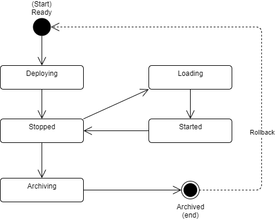
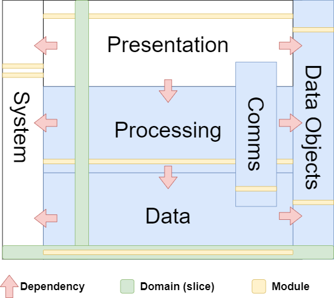

# Hydrogen: P2P Framework

Copyright © Sphere 10 Software 2018 - Present

Hydrogen is a .NET-based framework for building scalable P2P blockchain applications. It is a broad framework that can be used for building  layer-1 blockchain-based systems as well as layer-2 extensions to those systems. 

The Hydrogen framework offers the following features:

- **Node**: a fully functional node with it's own console-based GUI. The node provides data-persistence for blockchain and consensus databases, networking layer for P2P protocols, key management for wallets, JSON APIs for integration and all the core functionality typically offered by a node.
- **GUI**: a Blazor-based GUI for interacting with the node. This piece includes a rich-set of widgets useful for composing applications.
- **In-protocol upgrades**: applications control how they are upgraded and can be upgraded automatically from the blockchain itself (typically through governance protocol).  Absolutely everything can be upgraded including the node and UI. 
- **Automatic Interoperability**: hydrogen applications can easily interoperate with one another with complex workflows and patterns (publish-subscribe, send-and-forget, sagas) via the Helium framework.
- **Plug-n-Play**:  plugins that can extend both the Node and/or GUI and which can be installed dynamically.
- **Extensible**: in addition to plugins, the the framework offers extension points at various layers of the architecture.
- **Cross-platform**: runs on any OS that supports .NET 5 framework.

## Links

[What is a 3-tier Architecture?](doc/Guidelines/3-tier-Architecture.md)

[What is the Hydrogen Framework?](doc/Architecture/Hydrogen.md)

[Framework Domains](doc/Architecture/Domains.md)

[Code-Styling Guidelines](doc/Guidelines/Code-Styling.md)

## Overview

#### Runtime Model

#### Application Lifecycle

#### Subsystem composition

#### Code Structuring (3-tier)

