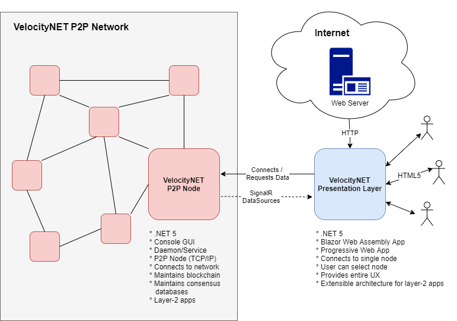

<pre>
  Author: Herman Schoenfeld <herman@sphere10.com>
  Version: 0.1
  Date: 2020-12-14
  Copyright: (c) Sphere 10 Software Pty Ltd
  License: Confidential and not for public disclosure
</pre>

# VelocityNET Project - Presentation-tier development

Sphere 10 Software is building a next-generation cryptocurrency project involving proprietary new technology. The project is architecturally composed of two main sub-systems, the backend node and the front-end progressive web app. The backend will be a console-based application and will act as a P2P node within VelocityNET. The backend takes care of all computational, cryptographic, consensus aspects and networking of the system.  The frontend provides the high-quality presentation layer for the system. The frontend allows layer-2 application builders to extend the UI. 

## Presentation-Tier 

The presentation-tier will be composed of a Blazor-based .NET application utilizing cutting edge patterns and approaches. The presentation-tier will allow users to interact with the core VelocityNET system as well as the Layer-2 "pluggable apps" that will integrate into the system.  As those specific application requirements are still in development, the presentation-tier will be developed in phases.

1. **Phase 1: Presentation Framework**: this phase will entail building the UI skeleton and reusable components which will be used in phase 2 to assemble the application. In simple terms, in phase 1 we design/build (and test) the "lego blocks" whereas in phase 2 we put the lego blocks together to make an application. 

2. **Phase 2: Application Assembly**: this phase will involve assembling together the MVP version of VelocityNET from the components built Phase 1. The focus here will be on the application domains rather than the components, although some effort to fix/refactor components will be required. 

3. **Phase 3: Integration and finalization**: this is the final phase where front and back-ends are integrated, code is cleaned up and project is finalized for the first MVP release of the system.

### Phase 1:

In this phase we will develop the application theme/style and a set of re-usable components. The degree of reusability intended for the controls is restricted to within the application **not** generic for other applications. This narrowing of the reusability requirement allows the code to make assumptions about the system that it would otherwise not be able to make resulting in more efficient and productive development.

#### Core UI:

- Main Frame: The core UI frame that hosts all application screens, etc.
- Navigation Pattern: The navigation for transitioning screens, showing pop ups and dialogs, etc.
- Plug-n-Play Pattern: The core UI frame loads up plugins which provide screens and menu items. The main application will itself be loaded up as a plugin. Developers will be able to extend the application through the development of plugins.
- Dynamic Data-Source Pattern: the URI of the server backend which provides the data-sources can be changed at any time, and the UI will provide a drop-down list of available servers.

#### UI Controls:

- Common Controls: find a suitable library we can incorporate into project that permits MIT redistribution.

- Entity Grid: a pageable and configurable data grid that displays data (not editable)

- Rapid Grid: a non-pageable, fixed-size grid that shows rapid amounts of data being pushed by a data-source

- Autocomplete Search Bar: search bar with throttled autocomplete popups.

  

#### Dialogs/Popups

- Exception Dialog: a custom error dialog for showing exceptions/error.
- Info Dialog: a flexible dialog for displaying info/warning/error message.
- Question Dialog: a flexible dialog for seeking user confirmation. Has options for many buttons and for labelling buttons.
- Wizard Dialog: a flexible mini-framework for managing wizard workflows. Basically a host dialog with Next/Back and Cancel buttons. The Next/Back buttons transition to new screen passing same property bag.

#### Other:

- App theme/styling: The theme should be established up-front.
- Loading transition: visually appealing loading widget for app start-up and other blocking workflows
- Mobile support: dialogs/grids/wizards should all work well in mobile.

**NOTE** These lists are subject to change during Phase 1 development.

## Deliverable 

The final deliverable for Phase 1 will be a Blazor Web Assembly app called "VelocityNET Widgets". This app will show-case all the above controls and elements in action. This app will also serve as a reference for Layer-2 app developers to build apps over VelocityNET. The app will subdivide the above widgets into 2 plugins which will be dynamically loaded as a proof-of-concept that the plugin architecure works as expected.