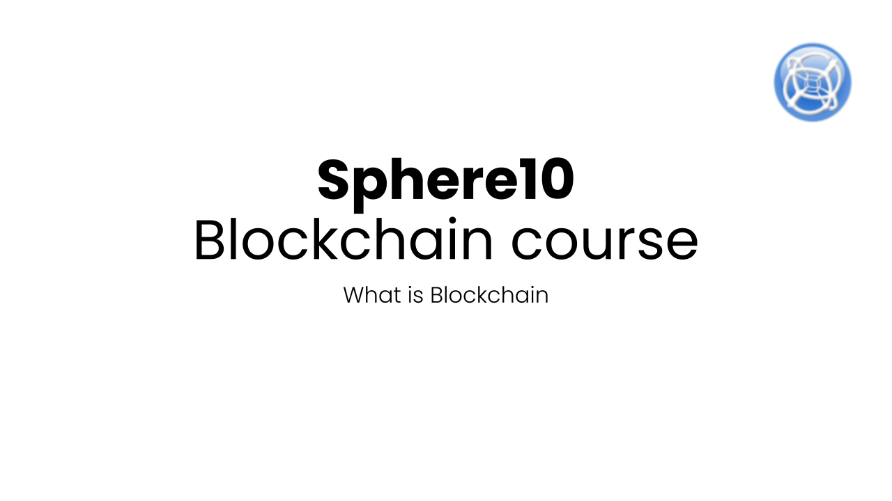
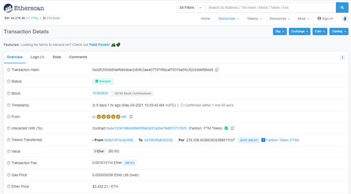
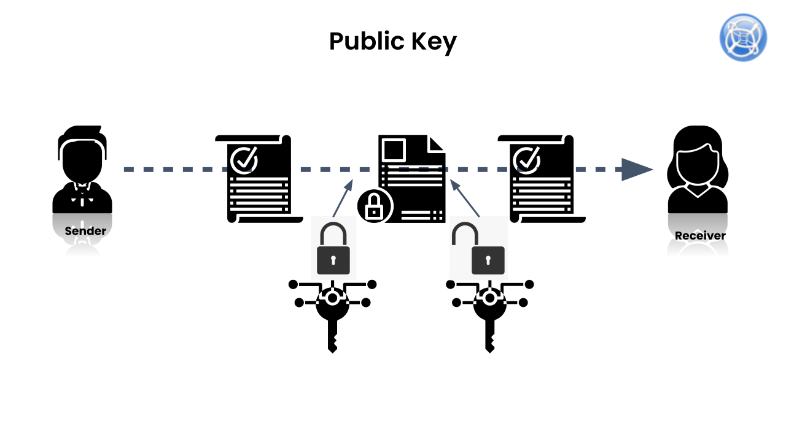
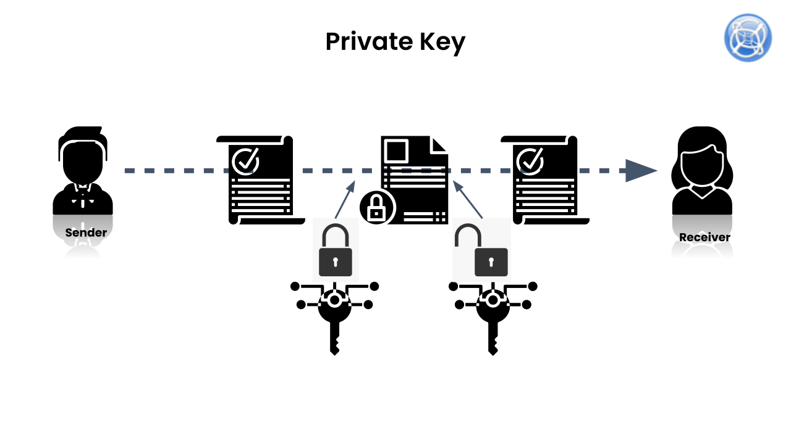
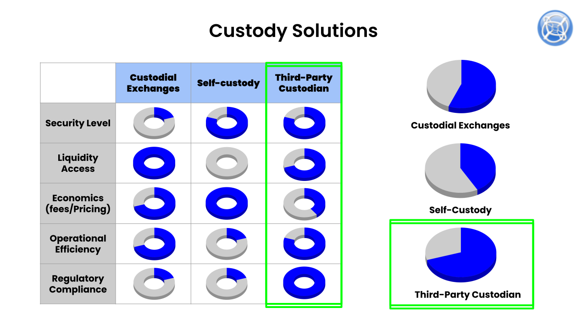
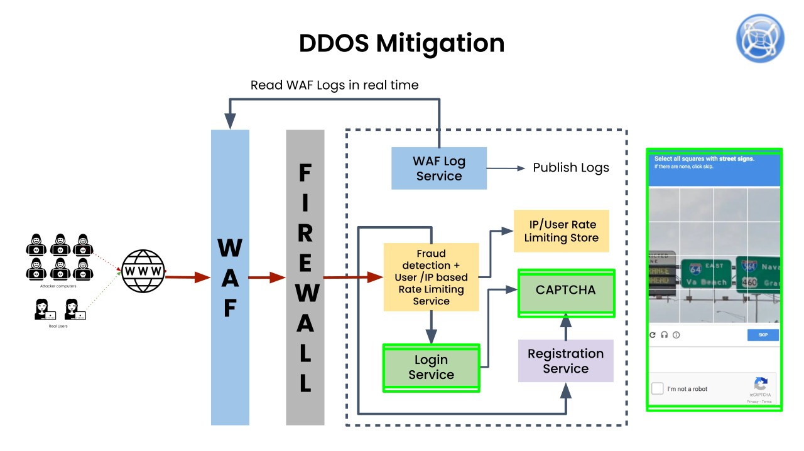

# What is Blockchain

### Topics

[What is Bitcoin and Proof of Work?](#What-is-Bitcoin-and-Proof-of-Work)

[Difficulty Targeting](#Difficulty-Targeting)

[Hash power and hash rate](#Hash-power-and-hash-rate)

[Nonce](#Nonce)

[Merkle Root](#Merkle-Root)

[Block Header](#Block-Header)

[UTXO Model](#UTXO-Model)

[Account Model](#Account-Model)

[Game Theory](#Game-Theory)

[What is Byzantine Fault Tolerance?](#What-is-Byzantine-Fault-Tolerance?)

[Public Key](#Public-Key)

[Private Key](#Private-Key)

[What are Digital Signatures?](#What-are-Digital-Signatures?)

[What is a Double Spend?](#What-is-a-Double Spend?)

[Custody Solutions](#Custody-Solutions)

[Cold Wallets](#Cold-Wallets)

[Hot Wallets](#Hot-Wallets)

[DDOS Attack](#DDOS-Attack)

[DDOS Mitigation Strategies](#DDOS-Mitigation-Strategies)

## What is Bitcoin and Proof of Work?

Bitcoin can be thought of simply as a digital ledger which lists accounts and the amounts of money that have been sent back and forth between those accounts, the same way as an accounting ledger tracks debits and credits. A copy of this file is maintained on every computer (or node) in the Bitcoin network, and anyone is able to add a transaction to the ledger, provided they sign the transaction.

When Jack wants to send money to Jill, he transmits a request to the network stating that he would like to send money to Jill. The nodes (or miners) on the network then compete to win the ability to validate that transaction in a process called “mining”.

.svg)

Bitcoin mining is the computational process of confirming transactions on the blockchain which involves an ongoing guessing game to solve a complex mathematical puzzle. Miners run sophisticated algorithms (the Bitcoin core codebase) in order to solve these problems and are rewarded in the form of newly-minted Bitcoins for doing so – this process is called Proof of Work.

For miners to earn these new bitcoins, they must satisfy two requirements;

1. They need to have verified ~1MB worth of transactions
2. They need to be the first or miner to solve the mathematical puzzle correctly (or in some cases have the closest solution), which involves a certain element of luck

The complexity of the mathematical puzzle is a function of;

- the number of people using the network (network traffic)
- the number of miners and their total computational power (also referred to as the Hashrate)

The second point is where the “Work” in Proof of Work comes in – miners require powerful, specialized computers called ASIC Miners so as to keep up with the demand of the network. This results in a substantial investment not only in terms of infrastructure costs but also electricity costs, meaning those miners with the most resources stand the best chance of being able to mine new bitcoins.

Over time, miners with more computing power will succeed and the more mining power the network has, the harder or more difficult it becomes to solve the mathematical computation. In other words, the more miners join the network, the more difficult the problem becomes to solve.

## What is Proof of Stake

Many opponents of Proof of Work consensus point to the fact that it is incredibly energy intensive and as a result very inefficient.

In a bid to avoid these inefficiencies, the Proof of Stake consensus mechanism was developed early on by the Peercoin team - in this consensus mechanism, miners called “stakers” are rewarded with new coins commensurate with the “weight” of their stake.

.svg)

That is, the more coins you hold in your wallet, the larger share of new coins you receive when they are minted, in exchange for running a transaction validation node. This mechanism also makes it significantly harder for a group of miners to collude and gain a 51% control of the network.

The Proof of Stake model uses a different process to confirm transactions and reach consensus. The system still uses a cryptographic algorithm, however the objective of the mechanism is different as individuals aren’t mining. Instead, they are called 'forgers', because there is no block reward.

While Bitcoin, which uses the Proof of Work model, awards a block reward every time a new block is verified, those who contribute to the Proof of Stake system simply earn the transaction fee by ensuring they hold the requisite amount of coins in their wallet at all times.

Most Proof of Stake blockchains also provide the opportunity for stakers to receive additional rewards by allowing them to propose and participate in governance proposals. In order for participants to do so they must hold a pre-specified amount of coins in their wallet so as to be eligible for submitting proposals and for voting.

## Mempool

The mempool can be thought of as a list of unconfirmed transactions waiting to be mined in the next block, in other words it is a list of “pending” transactions that are yet to be validated and finalized by miners in the blockchain network. As previously discussed, when a user submits a transaction, it is broadcasted to the network of miners/nodes across the entire blockchain network who then run computational code to validate the transaction.

.svg)

Confirmations – in order for a transaction to be “finalized” they generally need to be validated and added to the block by a minimum number of miners; this minimum number is commonly referred to as “the number of block confirmations” and for Bitcoin 6 confirmations are generally considered as “safe” to consider your transaction as having been securely processed by the network. In the case of Ethereum this number sits around the 20 confirmations mark.

Transaction processing time – during times of peak activity and high network traffic, miners will prioritize the processing of transactions with the highest fees, as a result this can cause a build up of unconfirmed transactions in the mempool. The number of unconfirmed transactions in the mempool can be used as a key indicator or gauge of overall network traffic as well as estimating network fees.

## Difficulty Targeting

Before we discuss mining difficulty, we must first explain what a “Hash” is. A hash is another word for a uniquely and randomly generated string of letters and numbers representing a transaction on the blockchain network, based on a pre-determined set of rules that are fed into an algorithm. Different blockchains use different cryptographic hashing algorithms to generate this string, each with specific rules about where each letter and number is sourced from in order to construct the string. The most common and widely used hashing algorithm is Bitcoin’s SHA256 algorithm.

Mining difficulty concerns the difficulty of mining a block in the bitcoin blockchain, or in other words, the difficulty in which to solve the cryptographic puzzle. This is a key mechanism for ensuring the stability for several reasons;

- Helps protect the network against sybil attacks by increasing the “cost to attack”
- Keeps the transaction processing / block finalization times within an acceptable target range (generally every 10 minutes)
- Incentivizes and prioritizes the processing of transactions which cost the most (highest fees)

In order to determine mining difficulty, the bitcoin core code contains an algorithm for calculating the “target” hash rate depending on increases or decreases in network traffic, this target hash rate is readjusted every 2,016 blocks to account for the latest network traffic data.

.svg)

To illustrate simply, if miners are finding it easy to solve cryptographic puzzles and are doing so in less than 10 minutes, the algorithm readjusts the difficulty upwards so as to bring the block finalization time back into the 10-minute target range. The same occurs when blocks are taking longer than 10 minutes to finalize, the mining difficulty adjust downwards.

.svg)

## Hash power and hash rate

As mentioned in previous sections, miners must compete to win the right to validate a transaction on the blockchain network. In order to do this, they require powerful computers to solve the cryptographic hashing puzzle, and as and when the difficulty of solving those puzzles increases, more computational power is required to solve puzzles faster than other miners.

The hash rate is simply the number of cryptographic puzzles (hashes) that the miner’s hardware can solve in one second. Subsequently, the hash power is the total computational power that a bitcoin miner’s hardware infrastructure can produce for the purposes of transaction validation. The cumulative hash power of the entire network can be used as a gauge for assessing the cost of mining one bitcoin and a key metric for determining profitability prior to deploying mining infrastructure.

.svg)

## Nonce

A nonce is short for “number only used once” and can be thought of as a randomly generated set of characters which enables a transaction to be uniquely identifiable on the network and that a user has only submitted that transaction once.

.svg)

One way of comparing a nonce’s functionality is to think about the way that captcha codes on high-traffic websites work, whenever a user submits a form (usually a login form) on a website, they are asked to solve a captcha code or puzzle prior to hitting the final submit button. This has the effect of delaying the transaction and preventing the user from submitting the form multiple times.

The same concept applies in the nonce model, in that a nonce specific to each transaction needs to be generated before a user can finalize a transaction. More on this in the DDOS mitigation strategies section.

## Merkle Root

A Merkle root can be thought of as a combination of all historical transactions mined in one specific block into one inter-connected tree.

The tree is made up of previous transaction hashes and their respective metadata – they are created via a repetitive process of pairing different permutations of hashes produced by miners until only one unique permutation of a hash is left – this is called the Root Hash or the Merkle Root. Once the root is formed it can then be included and stored in what is called a Block Header.

.svg)

Merkle Roots are a fundamental aspect of blockchain as they allow critical data is passed down from the previous block (Parent) to the next block (Child) so as to ensure the security and integrity of the network. They also allow for the checking and verification of historical states of transactions, as well as facilitating novel decentralized app development by enabling protocols to refer to specific metadata contained in transactions. Smart contracts make use of this metadata for enforcing rule-based computations when users interact with the app or protocol, such as payment verifications or access to specific app features based on one’s wallet balance of coins.

## Block Header

The Block Header forms the backbone of how transaction metadata is collected and constructed to determine how a block was mined and the transactions that were included in that block. This data includes;

- Block number
- Version number
- Previous Block Hash
- Merkle Root
- Block creation timestamp
- Difficulty Target
- Nonce
- List of all transactions in that block & their metadata

As a result of the above combination, each block header is cryptographically unique and secure – which is what gives it the commonly-referred to property of “immutability”, in other words it is extremely difficult for someone to edit or change this data – to do so would require a coordinated 51% attack of the network by miners. Similar to the transaction hashes, the block headers are also cryptographically hashed (constructed) into an 80 byte string using the Proof of Work consensus algorithm.

.svg)

## UTXO Model

The fundamental concept behind the Unspent Transaction Output (UTXO) model is that all inputs must equal all outputs for any transaction transmitted to the network and is an additional way of ensuring the security and validity of the network by performing checks for double spends. Simply put, it is a method for determining the number of coins a user has remaining in their wallet account balance after submitting a transaction to the blockchain network.

An easy way to think about this is the number of denominations of dollars someone has in their physical wallet. Let us say for instance Gabriel has \$50 in his wallet, made up of the following notes;

- \$20
- \$10
- \$10
- \$5
- \$5

Gabriel wants to buy a t-shirt from Julian which costs \$27, however Gabriel doesn’t have the exact change, so Gabriel decides to pay Julian \$30 for a t-shirt using 1 x \$20 note and 1 x \$10 note.

Julian then gives Gabriel back \$3 change in the form of 3 x \$1 coins. After this transaction is complete Gabriel takes the \$3 in change and puts it back into his wallet.

The leftover \$3 coins from the transaction are “unspent” and thus can be compared to the unspent bitcoins that a user has in their wallet after submitting a transaction to the blockchain network. Subsequent transactions must reflect the current state of the unspent bitcoins in the wallet because previous transactions (and blocks) cannot be edited or changed.

In the case of the bitcoin blockchain network, Gabriel needs to specify (in the same transaction message) the number of coins to send to Julian and the number of coins that will be leftover in Gabriel’s wallet as change. Bitcoin further facilitates this via its own denomination system via decimals called satoshis, which are fractions of bitcoins.

.svg)

## Account Model

The account model, as it states, lists the balances of coins across accounts (or wallets). In other words, it is similar to a bank account in that it is a record of how many coins a user has in their wallet at any point in time (also known as the “state” of the blockchain).

.svg)

A simple way to think about the “state” of the blockchain is to navigate to the Ethereum network, specifically the Etherscan website, and view the details of a specific transaction (or event). This view outlines a number of details which happened at that point in time, such as the sender address, receiver address, number of tokens transferred – all these details are referred to as the state of the accounts involved in the transaction on the network at that point in time.

In the account-based model, when a user submits a transaction to the network, the nodes on the network run code to debit the sender’s account balance and credit the receiver’s account balance. In order to prevent double spends in this model, something called a “nonce” is attached to each and every transaction.

## Game Theory

Game Theory is a theoretical framework for assessing decision making in group settings where different players have competing interests or motives, in other words, it is the science of assessing the different strategies that players can potentially implement in order to arrive at an optimal outcome. The theory was introduced in the 1960’s by American economist Thomas Schelling – Schelling describes this optimal outcome as a “focal point” or default solution that people diverge towards given the same information yet not being able to communicate with each other.

A common analogy and concept used to explain game theoretic principles is what is termed as the “Prisonner’s Dilemma”, a scenario where two detainees are being interrogated for a crime in separate rooms and are faced with deciding whether or not to cooperate with authorities in exchange for a leaner sentence. In this scenario, the detainees do not have the same information at hand and as a result will by default act in such a way as to protect their own self-interests, meaning only a sub-optimal outcome can be achieved for both detainees.

The scenario can be illustrated in the following diagram outlining the possible outcomes if Gabriel either remains silent or confesses:

.svg)

Gabriel has 2 options:

1. He remains silent and does not incriminate Julian, resulting in the following outcomes;
    1. They both walk free or
    2. Julian confesses and is sentenced to 2 years, whereas Gabriel is sentenced to 5 years
2. He confesses and incriminates Julian, resulting in the following outcomes;
    1. Gabriel only receives a max 2-year sentence
    2. Julian is sentenced to 5 years and Gabriel is sentenced to 2 years

As a result of the above, both Gabriel and Julian (being friends) assess the options available to them and would choose the option with the lowest possible sentence beneficial to each of them, making the optimal outcome or “focal point” 2 years. Game theory is a core concept which helps form the basis of byzantine fault tolerance in blockchains and helps to mitigate against malicious actors within a blockchain network.

## What is Byzantine Fault Tolerance?

The Byzantine General’s Problem was first referenced in a paper published in 1982, it is a principle based on game theory which seeks to answer the following question:

How do you make sure that multiple entities, separated by distance, are in absolute full agreement before an action is taken?

In order to illustrate this, the problem makes reference to a scenario whereby several companies (platoons or subdivisions) of soldiers are approaching a castle from different locations in order to make an attack on the Castle. 

The companies each have a General leading them into attack however due to the fact that they are approaching from different locations it is difficult for the soldiers to communicate and coordinate around strategy in order to attack simultaneously (they can send messages however those would take time to reach all Generals).

Furthermore, the other issue that the Generals have is that they are not aware of which soldiers are loyal or have the potential to betray them, making it harder for them to come to a decision about the optimal method of attack.

The latter problem is one which blockchain solves by providing a system whereby a distributed network of nodes validate that messages being sent by other nodes are valid and correct. In this system, all participating nodes must agree that the messages being transmitted are valid via a process called Proof of Work.

.svg)

## Public Key

A public key is a randomly generated cryptographic string of numbers and letters which represents a digital wallet address on the blockchain network. Its function is similar to that of a bank account in that it holds the balance of coins in the wallet and is used for the sending and receiving of coins between wallets, amongst other functions such as interacting with smart contracts.

In order for someone to be able to create and access a public key, they require a private key to unlock the public key. This public key/private key combination is what underpins the security of the blockchain and allows for the trustless exchange of information and value between two parties. This process is explored in more detail in the Digital Signatures section.

## Private Key

A private key grants a user access to a public key and subsequently grants access and control to the assets stored in a digital wallet. It can be compared to a complex password for a bank account and different blockchains utilise different methods for generating a private key.

The Bitcoin and Ethereum blockchains for instance use the 256-bit Elliptic Curve Digital Signature Algorithm (ECDSA) to generate a private key, other chains use less secure methods such as seed phrases or QR codes.

For added security, some wallet infrastructure providers also require the use of seed phrases in combination with the private key before granting access to the public key, the seed phrases usually consist of a unique combination of 12 or 24 words which a user needs to store in a safe place, preferably a USB drive, or some other form of cold storage which is not linked to the internet.

## What are Digital Signatures?

Digital signatures are immutable cryptographic proofs that someone has sent or received money to someone else. It is immutable in the sense that it is impossible for someone else to forge that signature as each sender and receiver has what is called a “Private Key / Public Key” combination which they use to sign transactions.

The Private Key is usually kept secret (the same as an email password) and the Public Key is similar to a bank account which someone provides to someone else should they wish to receive money.

.svg)

In order for 2 people to send money between each other on the network, the sender transmits a message by entering the recipient’s Public Key and “signing” the send transaction with their Private Key.

The mining network then encrypts the transaction with these details in a standard “message format” and sends the money to the Recipient’s public key, whose account is automatically credited with the amount sent.

This transaction record (also known as a “state”) is then permanently recorded into a block and added to the previous “chain” of transactions. Anyone in the future can then check that transaction record to verify that the sender and receiver did in fact own those public keys.

Because of this unique combination of Public and Private Key signatures for both sender and receiver, no two transactions will be the same and as a result signatures cannot be duplicated, modified or re-used.

## What is a Double Spend?

Digital Signatures allow us to verify the originator of the transaction and that they have sufficient money to spend when sending the transaction. This however does not solve for the potential of double spends, particularly if a blockchain network becomes compromised via a 51% attack and leading to the potential for transaction data to be manipulated.

Double Spends have everything to do with the timing of the sending and receiving of money, specifically, if transactions are not settled in real-time then there is a likelihood that account balances of different users could reflect incorrect (or duplicated) amounts of money and that money could be spent multiple times.

.svg)

For example, if the network is compromised and Bob has 0.1 BTC in his wallet, Bob sends 0.1 BTC to Alice in Transaction 1, however his account balance remains at 0.1 BTC, so he decides to send another 0.1 BTC to Alice in Transaction 2, meaning he has been able to spend the same amount of bitcoin multiple times.

How does Bitcoin solve for this? Via the mathematical race that is Proof of Work, specifically, in Proof of Work, transactions are ordered based on which miner solved the mathematical problem first via something called the Unconfirmed Transactions Pool, so in the example above, Transaction 1 would win the race and Transaction 2 would lose the race.

Winning transactions are then taken out of the pool and undergo a validity check against Account States (Confirmations) to ensure they reconcile prior to being added to the finalized block. More about the Unconfirmed Transactions Pool, Confirmations and Account States in later sections.

## Custody Solutions

Custody solutions refer to the many options and methods available for users or institutions to safely store their digital assets. An alternative way of viewing this is what is termed “operational security”, in other words, ensuring that as a blockchain user there are processes in place to ensure the security of one’s assets.

These solutions generally come in 3 forms as outlined in the below diagram, namely;

- Exchanges – where you hand over control and management of your public and private keys to the exchange
- Self-custody – you control and manage your own keys via either cold or hot wallets
- Third-party custodians – where an organization or group of individuals delegate control and management of keys to a specialist in the field based on a pre-determined set of rules and procedures

The pros and cons of using either of these methods vary depending on a person or organization’s situation and the choice of optimal solution comes down to the trade-offs a party is willing to make depending on the importance of certain features of the solution. 

From a blockchain purist perspective, the general rule of thumb applies that “not your keys, not your crypto” and as such the most secure way of storing your assets is via self-custody. This however becomes more complicated when a large fund or organization run by a Board of Directors would like to begin storing crypto assets and is generally where third-party custody solutions such as Fidelity Digital Assets are more suitable. 

That said, there are blockchain projects (such as the Gnosis Network) which offer something called a “multi-signature” wallet which requires two or more private keys to sign and send a transaction – it is usually recommended that multi-sig wallets also be 2/3 byzantine fault tolerant in terms of the number of private keys required to sign a transaction.

## Cold Wallets

Cold wallets usually refer to physical devices which store cryptographic assets and as a result provide a higher level of security (so long as the physical devices themselves are stored in a secret place).

The reason why this is the preferred method of storing assets is because the wallet is “offline” for the majority of the time and not connected to the internet, as a result it is a lot harder for them to be hacked.

The most common type of cold wallets is “Hardware wallets” and come in the form of small USB devices where the user can setup an account using a 4- or 6-digit passcode to unlock the device. The devices themselves can be used to generate a public/private key combination for a new wallet address. Drawbacks of using hardware wallets is that they can get lost easily, require constant maintenance to ensure they are running the latest driver firmware and are generally not user friendly with poor user interfaces.

## Hot Wallets

Hot wallets are generally held online either via a browser or mobile phone device. They are termed hot wallets as they can be setup and accessed very quickly and easily due to the user-friendly interfaces. Whilst hot wallets have several advantages and also increase the speed in which users can send/receive funds and interact with smart contract protocols, the risks involved with using them are greater due to the following reasons;

- Browser-based wallets can be vulnerable to viruses and trojan horse attacks
- Passwords can be hacked if copy pasted from other sources on a desktop
- Hackers can very accurately mimic the user interface and create fake wallets similar to the real wallet app, and subsequently steal funds

In general, it is highly recommended to use a combination of either the following for increase security;

- Cold Wallet + Mobile Wallet
- Browser Wallet + Mobile Wallet

In the case of the Browser + Mobile wallet combination, the TrustWallet mobile app can be used in conjunction with the WalletConnect browser extension to provide a secure way of unlocking a hot wallet via the use of a QR code. This is a novel way of unlocking a hot wallet as the user controls access to their wallet via their mobile app, and unlocks their browser extension wallet by scanning a QR code displayed inside the browser using the mobile app – this means the user does not have to enter or copy/paste a password and as a result reducing the likelihood of their wallet being compromised.

## DDOS Attack

A distributed denial of service attack (or DDOS for short) is a coordinated cyber attack conducted by malicious actors to attempt to take a website or webapp offline by directing a large amount of traffic towards the server on which the website is hosted. 

These are usually conducted via the use of malware and bots to generate a large number of false requests or transactions towards the IP address where the website is hosted. When this happens, the server is unable to cope with the heightened traffic and as a result goes offline.

It is important to understand the concept of DDOS attacks in the context of cryptocurrencies as the more popular they become the higher the number of scams begin to appear in the space.

## DDOS Mitigation Strategies

In order to combat DDOS attacks, most large scale applications and websites deploy several strategies to prevent an increase in traffic in the first instance - this is commonly referred to as "rate limiting" whereby a user has to go through several steps and checks prior to gaining access to a website.

As per the diagram below, a common approach and tool available to application developers (particularly those who utilise Amazon Web Services) is the deployment of a Web Application Firewall (WAF). A WAF sits on top of a website's normal firewall by monitoring incoming traffic and blocking potential malicious IP addresses from gaining access to the website - it does this by running a pre-determined set of rules and policies against the IP addresses to check for consistency and validity.

Once a user has successfully passed through the WAF they are then taken through another set of rules via a standard firewall before arriving to a login page. It is at this login page where the final rate limiting step needs to be completed, that being the solving of a captcha code. A captcha code is a manual puzzle that the user needs to solve in order to prove that they are not a bot.

---

[See all topics of this Lesson](#topics)

